# 📋 Physician Employment Contract Data Model

Physician employment contracts can be complex and difficult to navigate. This project aims to simplify the process by providing a standardized data model and a user-friendly web application that allows physicians to easily compare various contracts and negotiate better terms. With the help of AI-powered contract analysis, physicians can focus on their career goals and personal preferences while making informed decisions. This repository contains the physician employment contract data model, designed to support side-by-side comparisons and contract negotiation assistance for physicians.

This will be used to power Andwise's [physician employment contract analyzer.](https://blog.joinandwise.com/?p=contract-analyzer)

**Data Model Structure**

The data model is a structured representation of the data elements in a physician employment contract. It includes:

1. **Employment contract attributes**: These are the key details of the employment contract, such as salary, benefits, and work hours. They define the basic terms of employment.
2. **Contract provisions**: These are specific clauses in the contract that outline the rights and obligations of the parties involved. Examples include non-compete clauses and termination provisions.

```mermaid
classDiagram
    class EmploymentContract {
        - BasicInformation : BasicInformation
        - EmploymentStatusSetting : EmploymentStatusSetting
        - Compensation : Compensation
        - WorkSchedule : WorkSchedule
        - Benefits : Benefits
        - LegalContractualProvisions : LegalContractualProvisions
    }

    class BasicInformation {
        + emp_type : string
        + partnership_track : boolean
        + term_prov : string
        + contract_dur_renew : string
    }

    class EmploymentStatusSetting {
        + emp_status : string
        + prac_size : string
        + prac_spec : string
        + prac_set : string
    }

    class Compensation {
        + guar_base_sal : number
        + inc_bonus : number
        + profit_share : number
        + stock_opts : number
        + perf_bonus : number
        + ann_raise : number
        + ret_bonus : number
    }

    class WorkSchedule {
        + work_hours_sched_req : number
        + call_sched : string
        + flex_sched : boolean
        + remote_work : boolean
    }

    class Benefits {
        + TimeOff : TimeOff
        + InsuranceCoverage : InsuranceCoverage
        + RetirementFinancialBenefits : RetirementFinancialBenefits
        + ProfessionalDevelopmentEducation : ProfessionalDevelopmentEducation
        + WorkplaceSupport : WorkplaceSupport
        + WellnessWorkLifeBalance : WellnessWorkLifeBalance
    }

    class TimeOff {
        + vacation_days : number
        + sick_days : number
        + holidays : number
        + personal_leave : number
        + parental_leave : number
        + bereavement_leave : number
        + sabbatical_leave : number
    }

    class InsuranceCoverage {
        + health_ins : boolean
        + dental_ins : boolean
        + vision_ins : boolean
        + life_ins : boolean
        + disability_ins : boolean
        + malpractice_coverage : boolean
        + professional_liability_ins : boolean
        + pet_ins : boolean
    }

    class RetirementFinancialBenefits {
        + retire_benefits : boolean
        + retire_plan : string
        + health_savings_account : boolean
        + loan_repayment_assistance : boolean
        + flexible_spending_account : boolean
        + tuition_reimbursement : boolean
        + student_loan_assistance : boolean
    }

    class ProfessionalDevelopmentEducation {
        + cont_edu_allow : number
        + cme_days : number
        + prof_development : string
        + mentor_program : boolean
        + clinical_research_opportunities : boolean
        + faculty_appointment : boolean
        + paid_professional_development : boolean
    }

    class WorkplaceSupport {
        + ancillary_staff : boolean
        + med_license_expiration : boolean
        + dea_license_expiration : boolean
        + board_certification_expiration : boolean
        + membership_dues : boolean
        + promotion_opportunities : boolean
        + medical_director : boolean
        + community_outreach : boolean
    }

    class WellnessWorkLifeBalance {
        + wellness_program : boolean
        + employee_assistance_program : boolean
        + employee_discounts : boolean
        + paid_parental_leave : boolean
        + childcare_assistance : boolean
        + work_from_home : boolean
        + telemedicine_opportunities : boolean
        + pet_friendly_work : boolean
        + casual_dress : boolean
        + gym_membership : boolean
        + lunch_benefits : boolean
        + parking_benefits : boolean
        + commute_assistance : boolean
    }

    class LegalContractualProvisions {
        + NonCompeteOtherAgreements : NonCompeteOtherAgreements
        + TerminationSeverance : TerminationSeverance
        + CredentialingHospitalPrivileges : CredentialingHospitalPrivileges
        + PartnershipOwnershipOpportunities : PartnershipOwnershipOpportunities
        + CompensationStructurePaymentFrequency : CompensationStructurePaymentFrequency
        + ReportingStructureSupervision : ReportingStructureSupervision
        + PerformanceEvaluationFeedback : PerformanceEvaluationFeedback
        + RelocationAssistanceSigningBonuses : RelocationAssistanceSigningBonuses
        + MiscellaneousProvisions : MiscellaneousProvisions
    }

    class NonCompeteOtherAgreements {
        + non_comp_clause : boolean
        + non_solicit_agreement : boolean
        + conf_non_disclosure_agreement : boolean
        + IP_rights : boolean
    }

    class TerminationSeverance {
        + term_sev_prov : boolean
        + dispute_res_proc : string
    }

    class CredentialingHospitalPrivileges {
        + credential_hosp_priv : boolean
        + med_license : boolean
        + dea_license : boolean
        + board_certification : boolean
        + membership_dues : boolean
    }

    class PartnershipOwnershipOpportunities {
        + partnership_buy_in_out : boolean
        + ownership_equity_opp : boolean
    }

    class CompensationStructurePaymentFrequency {
        + comp_struct_pay_freq : string
        + reimb_exp_overhead : boolean
    }

    class ReportingStructureSupervision {
        + report_struct_superv : boolean
        + prof_growth_career_adv_opp : boolean
        + leader_opp : boolean
        + diversity_inclusivity_initiatives : boolean
        + cultural_competence_training : boolean
        + team_building_activities : boolean
    }

    class PerformanceEvaluationFeedback {
        + perf_eval_criteria : string
        + perf_eval_freq : string
        + peer_feedback : boolean
        + ongoing_mentorship : boolean
    }

    class RelocationAssistanceSigningBonuses {
        + reloc_assist : boolean
        + sign_bonus : number
    }

    class MiscellaneousProvisions {
        + appendix_docs : boolean
        + contract_amendments : boolean
        + governing_law : string
        + jurisdiction : string
        + force_majeure : boolean
        + unforeseen_circumstances : boolean
        + indemnification : boolean
        + liability : boolean
        + notice_communication : boolean
        + contact_info : boolean
        + communication_methods : boolean
        + entire_agreement : boolean
        + amendment_clause : boolean
        + arbitration_clause : boolean
        + mediation_clause : boolean
        + waiver_breach_clause : boolean
    }

    EmploymentContract "1" -- "1" BasicInformation : contains
    EmploymentContract "1" -- "1" EmploymentStatusSetting : contains
    EmploymentContract "1" -- "1" Compensation : contains
    EmploymentContract "1" -- "1" WorkSchedule : contains
    EmploymentContract "1" -- "1" Benefits : contains
    EmploymentContract "1" -- "1" LegalContractualProvisions : contains
    Benefits "1" -- "1" TimeOff : has
    Benefits "1" -- "1" InsuranceCoverage : has
    Benefits "1" -- "1" RetirementFinancialBenefits : has
    Benefits "1" -- "1" ProfessionalDevelopmentEducation : has
    Benefits "1" -- "1" WorkplaceSupport : has
    Benefits "1" -- "1" WellnessWorkLifeBalance : has
    LegalContractualProvisions "1" -- "1" NonCompeteOtherAgreements : has
    LegalContractualProvisions "1" -- "1" TerminationSeverance : has
    LegalContractualProvisions "1" -- "1" CredentialingHospitalPrivileges : has
    LegalContractualProvisions "1" -- "1" PartnershipOwnershipOpportunities : has
    LegalContractualProvisions "1" -- "1" CompensationStructurePaymentFrequency : has
    LegalContractualProvisions "1" -- "1" ReportingStructureSupervision : has
    LegalContractualProvisions "1" -- "1" PerformanceEvaluationFeedback : has
    LegalContractualProvisions "1" -- "1" RelocationAssistanceSigningBonuses : has
    LegalContractualProvisions "1" -- "1" MiscellaneousProvisions : has

```

The data model is designed to be easily extensible and adaptable, meaning it can be updated and modified to accommodate changes in contract formats and industry standards.

**Next Steps**

The next steps involve the development of several tools and features:

1. **AI-powered contract analysis tool**: This tool will use artificial intelligence to extract key data points from contracts, making it easier to understand and compare different contracts.
2. **Web application**: This application will allow physicians to upload, view, and compare contracts in a user-friendly interface.
3. **Advanced search and filtering capabilities**: These features will enable users to find and sort contracts based on specific criteria.
4. **Contract negotiation support feature**: This feature will provide personalized recommendations to help physicians negotiate their contracts.

**Employment Details**

The employment details section includes a wide range of data points, organized into several categories:

1. **Basic Information**: This includes the type of employment, whether there's a partnership track, the provisions for contract duration and renewal, and more.
2. **Employment Status and Setting**: This covers the employment status of the physician, the size and specialty of the practice, and the practice setting.
3. **Compensation**: This includes the guaranteed base salary, any potential bonuses, profit sharing, stock options, annual raises, and retirement bonuses.
4. **Work Schedule**: This covers the required work hours, call schedule, flexibility of the schedule, and opportunities for remote work.
5. **Benefits**: This includes various types of time off (vacation, sick days, holidays, personal leave, etc.), insurance coverage, retirement and financial benefits, professional development and education opportunities, workplace support, and wellness and work-life balance initiatives.

**Legal and Contractual Provisions**

This section covers various legal and contractual provisions, including non-compete and other agreements, termination and severance provisions, credentialing and hospital privileges, partnership and ownership opportunities, compensation structure and payment frequency, reporting structure and supervision, performance evaluation and feedback, relocation assistance and signing bonuses, and miscellaneous provisions.

Each of these categories includes a number of specific data points, which are represented as variables in the data model. For example, the "non\_comp\_clause" variable represents the presence and details of a non-compete clause in the contract.

This data model provides a comprehensive framework for analyzing and comparing physician employment contracts. It can be used to develop tools and applications that help physicians understand their contracts and make informed decisions about their employment.

## Employment Details

### Basic Information

* emp\_type
* partnership\_track
* term\_prov
* contract\_dur\_renew

### Employment Status and Setting

* emp\_status
* prac\_size
* prac\_spec
* prac\_set

### Compensation

* guar\_base\_sal
* inc\_bonus
* profit\_share
* stock\_opts
* perf\_bonus
* ann\_raise
* ret\_bonus

### Work Schedule

* work\_hours\_sched\_req
* call\_sched
* flex\_sched
* remote\_work

## Benefits

### Time Off

* vac\_days
* sick\_days
* holidays
* pers\_leave
* parental\_leave
* bereave\_leave
* sabb\_leave

### Insurance Coverage

* health\_ins
* dental\_ins
* vision\_ins
* life\_ins
* disability\_ins
* malpractice\_cov
* prof\_liab\_ins
* pet\_ins

### Retirement and Financial Benefits

* retire\_benefits
* retire\_plan
* health\_sav\_acct
* loan\_repay\_assist
* flex\_spend\_acct
* tuition\_reimb
* student\_loan\_assist

### Professional Development and Education

* cont\_edu\_allow
* cme\_days
* prof\_devel
* mentor\_prog
* clin\_research\_opp
* fac\_appointment
* paid\_prof\_devel

### Workplace Support-

* ancillary\_staff
* med\_license\_exp
* dea\_license\_exp
* board\_cert\_exp
* member\_dues
* promo\_opp
* med\_director
* comm\_outreach

### Wellness and Work-Life Balanc

* wellness\_prog
* emp\_assist\_prog
* emp\_discounts
* paid\_parent\_leave
* childcare\_assist
* work\_from\_home
* telemed\_opp
* pet\_friendly\_work
* casual\_dress
* gym\_memb
* lunch\_ben
* parking\_ben
* commute\_assist

\##Legal and Contractual Provisions

### Non-Compete and Other Agreements

* non\_comp\_clause
* non\_solicit\_agree
* conf\_non\_disclosure\_agree
* IP\_rights

### Termination and Severance

* term\_sev\_prov
* dispute\_res\_proc

### Credentialing and Hospital Privileges

* credential\_hosp\_priv

### Partnership and Ownership Opportunities

* partnership\_buy\_in\_out
* ownership\_equity\_opp

### Compensation Structure and Payment Frequency

* comp\_struct\_pay\_freq
* reimb\_exp\_overhead

### Reporting Structure and Supervision

* report\_struct\_superv
* prof\_growth\_career\_adv\_opp
* leader\_opp
* diversity\_inclusivity\_initiatives
* cult\_compet\_train
* team\_building\_activities

### Performance Evaluation and Feedback

* perf\_eval\_criteria
* perf\_eval\_freq
* peer\_feedback
* ongoing\_mentorship

### Relocation Assistance and Signing Bonuses

* reloc\_assist
* sign\_bonus

\##Miscellaneous Provisions

### Appendix and Supporting Documents

* appendix\_docs
* contract\_amendments

### Governing Law and Jurisdiction

* governing\_law
* jurisdiction

### Force Majeure and Unforeseen Circumstances

* force\_majeure
* unforeseen\_circumstances

### Indemnification and Liability

* indemnification
* liability

### Notice and Communication

* notice\_communication
* contact\_info
* communication\_methods

### Entire Agreement and Amendment

* entire\_agreement
* amendment\_clause

### Arbitration and Mediation

* arbitration\_clause
* mediation\_clause

### Waiver of Breach

* waiver\_breach\_clause

Thank you for your interest in contributing to the Physician Employment Contract Data Model! Together, we can help physicians navigate the complex world of employment contracts and make better-informed decisions for their careers.
