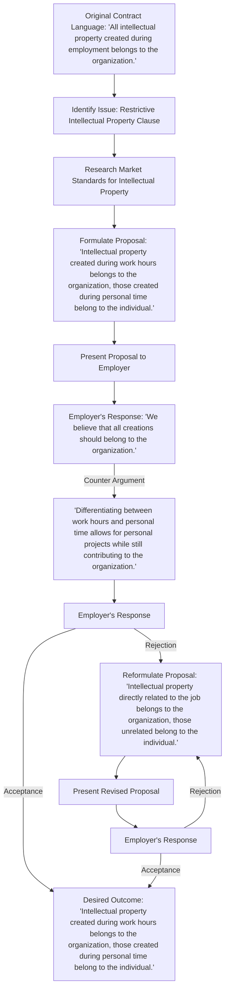

# Intellectual Property Clauses

Intellectual property clauses in physician contracts can be complex and require careful consideration to protect the rights of physicians engaged in creative or innovative activities outside of their clinical work. This article provides a step-by-step guide on how to navigate these clauses effectively, ensuring that physicians retain ownership of their intellectual property and achieve a favorable outcome.

#### Understanding Intellectual Property

Before diving into the negotiation process, it's essential to understand the various types of intellectual property, such as patents, copyrights, and trademarks. By identifying the specific type of intellectual property that applies to your work, you can better protect your inventions, creative works, and ideas.

#### Identifying Intellectual Property Clauses

The first step in navigating intellectual property clauses is to identify them in your contract. These clauses govern the ownership and control of intellectual property created during the course of your employment. Carefully review your contract to ensure that the clauses cover the relevant types of intellectual property and clearly define the rights and responsibilities of both parties.

#### Assessing the Scope and Rights

Once you've identified the intellectual property clauses, it's crucial to assess their scope and the rights they grant to your employer. Consider whether the clauses apply solely to work done within the scope of your employment or if they extend to activities outside of your professional responsibilities. Clearly define the rights you wish to retain for your personal creative endeavors and ensure that the clauses respect your ownership and control over your intellectual property.

#### Negotiation Strategies

When negotiating intellectual property clauses, consider the following strategies:

1. **Clearly define the boundaries:** Specify the limits of the intellectual property clause to avoid any ambiguity. Clearly separate your personal projects and creative works from the intellectual property that falls within the scope of your employment.
2. **Request exceptions:** Advocate for exceptions to the clause that allow you to retain ownership of certain inventions, research, or creative works. This ensures that you can continue pursuing your personal projects without interference from your employer.
3. **Discuss licensing or royalties:** If your employer insists on owning the intellectual property, negotiate licensing or royalty agreements. This allows you to receive fair compensation if your work is commercialized or used for other purposes.
4. **Consider time limitations:** Discuss the duration of the clause. Aim for a reasonable timeframe that aligns with the typical lifespan of the intellectual property in question. This prevents the clause from unnecessarily restricting your ability to use or monetize your intellectual property in the future.
5. **Seek legal advice:** Engage an attorney specializing in intellectual property and physician contracts to review your contract, provide guidance during negotiations, and ensure that your rights are protected.

#### Conclusion

Navigating intellectual property clauses in physician contracts requires careful consideration and proactive negotiation. By understanding the types of intellectual property, identifying the clauses in your contract, assessing their scope and impact, employing effective negotiation strategies, and seeking legal advice when needed, you can protect your intellectual property rights and secure an agreement that respects your ownership and control.

[Edit the flowchart online.](https://showme.redstarplugin.com/s/WFAqRxZ2)
