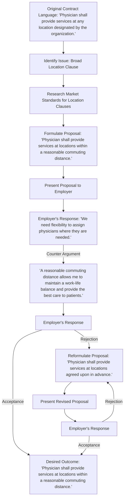

# Location Clauses

Location clauses in physician contracts play a significant role in determining where you will provide your services. These clauses can have a profound impact on your work-life balance and overall satisfaction. Understanding and negotiating these clauses effectively is crucial for physicians seeking a reasonable and conducive work environment. In this article, we will guide you through the process of negotiating fair and flexible location clauses that meet your needs.

#### Understanding Location Clauses

Location clauses specify the geographical area or facilities where physicians are expected to practice medicine. They can range from broad regions to specific locations. Understanding the implications of location clauses in your contract is essential for effective negotiation.

#### Assessing the Scope and Impact

Once you've identified the location clause in your contract, assess its scope and potential impact on your professional and personal life. Consider factors such as commuting distance, housing availability, proximity to family and support networks, and the local healthcare market. Evaluate whether the proposed location aligns with your preferences and allows for a healthy work-life balance.

#### Negotiation Strategies

When negotiating location clauses in physician contracts, consider the following strategies:

1. **Flexibility and specificity:** Seek a location clause that offers reasonable flexibility while still providing sufficient specificity. This

allows for adjustments based on changing circumstances, such as shifts in patient demographics or healthcare needs.

2. **Geographical boundaries:** Discuss the geographical boundaries mentioned in the clause. If they are overly broad, negotiate for more specific locations or a narrower region that aligns with your preferences and professional goals.
3. **Relocation provisions:** If the location clause requires relocation, negotiate provisions that address relocation expenses, temporary housing, and other support. Ensure that the terms are fair and reasonable, considering the financial impact and potential disruptions to your personal life.
4. **Balancing work-life considerations:** Discuss the potential impact on work-life balance and patient care if the location clause results in excessive commuting or long-distance relocations. Propose solutions that prioritize patient continuity, such as schedule adjustments or considerations for telemedicine options.
5. **Seek legal guidance:** Engage an attorney specializing in physician contracts to review the location clause, provide advice on negotiation strategies, and protect your rights and interests.

#### Conclusion

Negotiating a fair and flexible location clause in your physician contract is essential for achieving a sustainable work-life balance and aligning your professional goals with your personal preferences. By understanding the implications, employing effective negotiation strategies, and seeking legal advice when necessary, you can secure an agreement that accommodates your needs and promotes professional satisfaction.

[Edit the flowchart online.](https://showme.redstarplugin.com/s/L9vfIJom)
