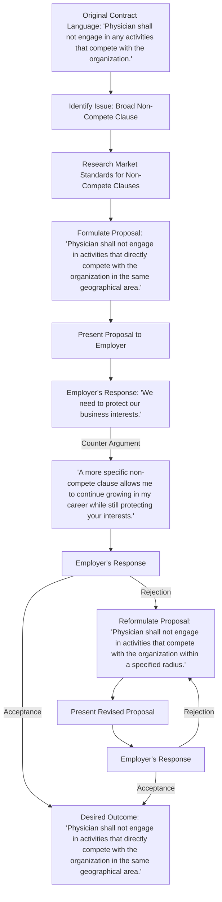

# Non-Compete Clauses

Non-compete clauses in physician contracts can significantly impact physicians' career growth and mobility. These clauses restrict physicians from practicing in certain geographical areas or within specific timeframes after leaving their current employment. Understanding how to handle and negotiate non-compete clauses is essential for preserving professional opportunities and ensuring flexibility. In this article, we provide a step-by-step guide on how to negotiate a fair and reasonable non-compete clause that allows physicians to pursue their career aspirations.

#### Understanding Non-Compete Clauses

Non-compete clauses aim to protect employers' interests by preventing physicians from working for competitors or establishing competing practices. These clauses vary in scope, duration, and geographical restrictions. It's important to understand the implications of non-compete clauses in your contract.

#### Assessing the Impact

Once you've identified the non-compete clause, evaluate its potential impact on your career and future opportunities. Consider factors such as the geographical area covered by the clause, the duration of the restriction, and the potential effect on patient continuity and professional relationships. Assess whether the limitations are reasonable and necessary.

#### Negotiation Strategies

When handling non-compete clauses in physician contracts, consider the following negotiation strategies:

1. **Define the scope and duration:** Clearly define the geographical area and duration of the non-compete clause. Discuss whether the scope can be narrowed to specific locations or a reasonable radius around your current workplace. Aim for a duration that aligns with industry standards and does not excessively restrict your ability to practice in the future.
2. **Request exceptions:** Advocate for exceptions to the non-compete clause that allow you to continue working in certain settings or within specific patient populations. Highlight the value you bring to these areas and how your practice in those settings does not directly compete with your current employer.
3. **Negotiate for compensation or buyout options:** If the non-compete clause significantly restricts your career options, discuss the possibility of financial compensation or a buyout provision. This ensures that you are not unfairly limited in your professional growth and that you are appropriately compensated for the restrictions placed on your ability to practice.
4. **Demonstrate goodwill and patient-centered focus:** Emphasize your commitment to patient care and continuity while addressing any concerns about competition. Highlight how your practice will benefit the community and patients in the new location.
5. **Seek legal advice:** Engage an attorney specializing in physician contracts to review the contract, assess the enforceability of the clause, and provide guidance on negotiation strategies.

#### Conclusion

Handling non-compete clauses requires careful consideration and proactive negotiation. By understanding the implications, employing effective negotiation strategies, and seeking legal advice when necessary, physicians can secure a fair and reasonable non-compete clause that allows for professional growth and mobility while protecting their rights and interests.

[Edit the flowchart online](https://showme.redstarplugin.com/s/0RWgryDv)
