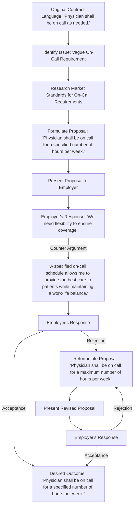

# On-Call Requirements

On-call requirements significantly impact physicians' work-life balance, personal time, and overall well-being. Negotiating clear and fair on-call requirements in physician contracts is essential for maintaining a fulfilling professional experience. In this article, we provide a practical roadmap for negotiating on-call requirements that strike a balance between patient care needs and personal well-being, allowing physicians to thrive in their careers and personal lives.

#### Understanding On-Call Requirements

On-call requirements refer to the periods when physicians are expected to be available outside of regular working hours to respond to emergencies or provide consultation. These requirements can vary widely depending on specialty, practice setting, and contractual obligations. Understanding the specifics of on-call requirements is essential for negotiating favorable terms.

#### Assessing the Impact

Once you've identified the on-call requirements in your contract, assess their potential impact on your personal life and well-being. Consider factors such as the frequency and duration of on-call shifts, the compensation or remuneration provided, and the availability of support staff or backup resources. Evaluate whether the requirements are reasonable and feasible given your desired work-life balance.

#### Negotiation Strategies

Here are some strategies for negotiating on-call requirements in physician contracts:

1. **Clearly define on-call expectations:** Seek clarity on the specific expectations, including the frequency, duration, and nature of on-call shifts. Understand the compensation structure for on-call work and whether there are additional incentives or benefits associated with these responsibilities.
2. **Rotation and fairness:** Discuss the possibility of creating a fair rotation schedule that distributes the on-call responsibilities equitably among all physicians in the practice or department. This ensures a balanced workload and prevents burnout.
3. **Compensation and incentives:** Advocate for fair compensation or incentives for on-call duties. This may include additional pay, time off, or other benefits to recognize the extra demands placed on physicians during on-call periods.
4. **Support systems and resources:** Address the availability of support staff or resources to assist with on-call responsibilities. Having adequate support can alleviate the burden and improve patient care during on-call shifts.
5. **Collaboration and flexibility:** Propose collaborative solutions, such as shared on-call arrangements or telemedicine options, that can help manage the on-call requirements effectively while balancing personal and professional obligations.

#### Conclusion

Negotiating fair on-call requirements in physician contracts is crucial for maintaining a healthy work-life balance and ensuring high-quality patient care. By understanding the impact of on-call requirements, employing effective negotiation strategies, and advocating for your needs, physicians can secure an agreement that supports their well-being, professional satisfaction, and overall success.

[Edit the flowchart](https://showme.redstarplugin.com/s/TyTzPJIr)
